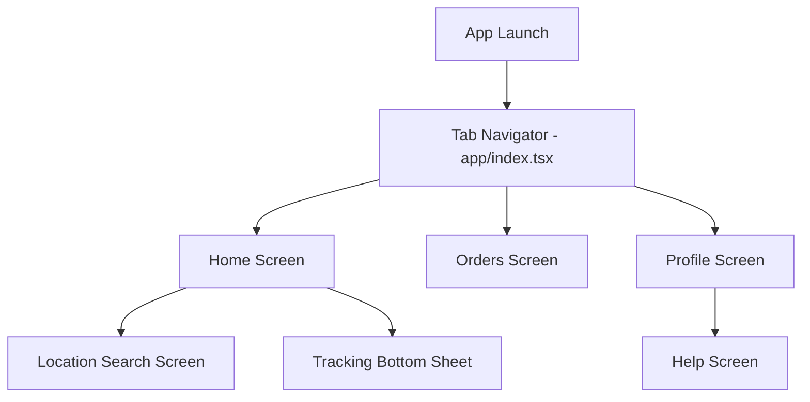

# Delhivery App Clone

A premium, highly-animated, pixel-perfect clone of the Delhivery mobile application built with React Native and Expo. This project pushes the boundaries of UI/UX engineering by employing complex custom animations, fluid gestures, and organic graphics to create a world-class user experience.

---

## 1. Project Overview

This repository is a comprehensive UI/UX clone of the Delhivery mobile app, demonstrating advanced React Native engineering. The application prioritizes fluid 60FPS animations, meticulous styling based on strict brand guidelines, and modern architectural patterns using bleeding-edge libraries like Expo Router, Reanimated 3, and Moti.

## 2. Features

- **World-Class Animated Backgrounds**: A dynamic sky simulating passing clouds and a soaring delivery plane.
- **Infinite Carousel with 3D Assets**: A perfectly looping carousel featuring complex inner animations (like a popping gift box).
- **Fluid Custom Tab Navigation**: A completely custom-built bottom tab bar with animated sparks, ripples, and glow effects.
- **Staggered Mount Animations**: Every single screen implements carefully orchestrated spring/timing mount animations to give a premium feel.
- **Micro-interactions**: Every button and touchable surface reacts dynamically to user input via Reanimated and Moti pressables.

## 3. Tech Stack

- **Core**: React Native (0.81.0) & React (19.1.0)
- **Routing**: Expo Router (~6.0.24) & Expo SDK (54.0.0)
- **Language**: TypeScript (~6.0.3)
- **Animations**: `react-native-reanimated` (~4.1.1), `moti` (^0.30.0), `react-native-gesture-handler` (~2.28.0)
- **UI & Lists**: `@gorhom/bottom-sheet` (^5.2.14), `@shopify/flash-list` (2.0.2)
- **State Management**: `zustand` (^5.0.15) & `@reduxjs/toolkit` (^2.12.0)
- **Storage**: `react-native-mmkv` (^4.3.2)
- **Network**: `axios` (^1.19.0) & `@tanstack/react-query` (^5.101.4)
- **Icons**: `lucide-react-native` (^1.31.0)

## 4. Project Architecture

The architecture relies on Expo Router for deep-linkable stack navigation, while maintaining a robust Zustand-driven state for custom tab navigation. It utilizes `moti` heavily for declarative, physics-based UI transitions and `react-native-reanimated` worklets for continuous ambient animations (like backgrounds).

## 5. Project Structure

```text
/
├── app/                  # Expo Router navigation (screens & layouts)
│   ├── _layout.tsx       # Root stack navigator with transition configs
│   ├── index.tsx         # Main entry point (Custom Tab Controller)
│   ├── location-search.tsx
│   └── help.tsx
├── src/
│   ├── assets/           # Images, fonts, static assets
│   ├── components/       # Reusable UI & Animated components
│   ├── constants/        # Application constants
│   ├── hooks/            # Custom React hooks
│   ├── navigation/       # Navigation utilities
│   ├── screens/          # Main screen views (Home, Orders, Profile)
│   ├── services/         # API layer / Networking
│   ├── store/            # Redux/Zustand global state (useNavigationStore)
│   ├── theme/            # Design system, Colors, Spacing tokens
│   ├── types/            # TypeScript definitions
│   └── utils/            # Helper functions
```

## 6. Screen Inventory

### Home Screen
* **Path:** `src/screens/HomeScreen.tsx` (Rendered via `app/index.tsx`)
* **Purpose:** The main landing screen featuring dynamic promotional content and quick actions.
* **Entry:** App launch / Home tab selection.
* **Actions:** View stories, open tracking details, search services.
* **Navigates to:** Location Search Screen, Tracking Bottom Sheet.
* **Animations:** Ambient sky background, staggering FlashList entrance, pulsing story circles.

### Orders Screen
* **Path:** `src/screens/OrdersScreen.tsx` (Rendered via `app/index.tsx`)
* **Purpose:** Allows users to track their shipments and AWB numbers.
* **Entry:** Orders tab selection.
* **Actions:** Search AWB, interact with active tracking cards.
* **Navigates to:** N/A (Root tab).
* **Animations:** Staggered upward slide and fade-in of cards and headers to match Profile screen perfectly.

### Profile Screen
* **Path:** `src/screens/ProfileScreen.tsx` (Rendered via `app/index.tsx`)
* **Purpose:** User account management, rewards, and support settings.
* **Entry:** Profile tab selection.
* **Actions:** Click menu items, edit profile.
* **Navigates to:** Help Screen (`/help`).
* **Animations:** Staggered menu group entry, bouncing/pulsing icon highlights, profile header scale-in.

### Location Search Screen
* **Path:** `app/location-search.tsx`
* **Purpose:** Allows users to find and select locations or drop pins on a map.
* **Entry:** Clicking the location header on the Home Screen.
* **Actions:** Type location, select via map, switch Recent/Saved tabs.
* **Navigates to:** Home (Back).
* **Animations:** Search input border/shadow transitions, animated tab sliding indicator, staggered entrance.

### Help Screen
* **Path:** `app/help.tsx`
* **Purpose:** Customer support, past conversations, and FAQ dropdowns.
* **Entry:** Profile Screen -> Help & Support.
* **Actions:** Expand FAQs, view conversations.
* **Navigates to:** Profile (Back).
* **Animations:** Accordion height expansion/collapse, staggered content entrance.

## 7. User Flow



## 8. Navigation Architecture
- **Expo Router (`app/`)**: Handles the Stack navigation, providing slide transitions (`_layout.tsx`) and mapping URLs to screens (`help.tsx`, `location-search.tsx`).
- **Custom Zustand Tab Router**: `app/index.tsx` manually renders `HomeScreen`, `OrdersScreen`, or `ProfileScreen` based on `useNavigationStore`, allowing the custom `AnimatedBottomTabBar` to control state without the constraints of standard React Navigation bottom tabs.

## 9. Animation Overview
Animations are integrated deeply into every layer. 
- **Ambient Animations**: Continuous background movements (planes, clouds) run endlessly on the UI thread via Reanimated `useAnimatedStyle`.
- **Mount Animations**: Using `MotiView`, every screen implements staggered entrance delays (`translateY` + `opacity`) to ensure content flows naturally onto the screen instead of popping in abruptly.
- **Interactive Animations**: Buttons shrink/grow on press via `MotiPressable`, and dynamic indicators follow user selection.

---

## 10. Complete Animation Registry

| # | Animation | Screen | Component | Trigger | Type | Implementation | Visual Effect |
| - | --------- | ------ | --------- | ------- | ---- | -------------- | ------------- |
| 1 | Continuous Sky Elements | Home | `HomeAnimatedBackground` | Mount | Ambient Translate/Opacity | Reanimated (`useAnimatedStyle`, `withRepeat`) | Plane flies across screen, clouds drift slowly, stars twinkle via opacity looping. |
| 2 | Staggered Feed Entry | Home | `HomeScreen` | Mount | Slide + Fade | Moti (`from`/`animate` with delay) | Story rings, carousels, and grids slide up and fade in progressively. |
| 3 | Story Item Pulse | Home | `HomeScreen` | Mount | Scale + Border | Moti (`transition.loop`) | The "Deliveries Made Easy" story border loops colors, text pulses scaling up/down. |
| 4 | Gift Box Entrance | Home | `HomeBannerCarousel` | Mount | Scale, Translate, Rotate | Moti (`from`/`animate` loops) | A premium gift box bounces, lid pops off, a gift peeks out, and sparkles fly out rapidly. |
| 5 | Grid Item Entrance | Home | `HomeServiceGrid` | Mount | Slide + Fade | Moti (`delay` stagger) | Grid icons pop in smoothly one by one. |
| 6 | Service Grid Arrow Bounce | Home | `HomeServiceGrid` | Mount | Translate | Reanimated (`useAnimatedStyle`) | Chevron arrows bounce horizontally continuously. |
| 7 | Active Tracking Pulse | Orders | `ActiveTrackingCard` | Mount | Shadow + Scale | Moti (`loop`) | The "Live" badge border pulses to draw attention. |
| 8 | Screen Elements Slide-Up | Orders | `OrdersScreen` | Mount | Slide + Fade | Moti (`translateY: 40`, `delay`) | Search bars, tracking cards slide up precisely matching Profile screen timings. |
| 9 | Profile Header Pop | Profile | `ProfileScreen` | Mount | Spring Scale | Moti (`type: spring`) | User avatar and details spring into view dynamically. |
| 10 | Menu Items Stagger | Profile | `ProfileScreen` | Mount | Slide + Fade | Moti (`translateY: 40`) | Settings blocks flow upward in a sequence. |
| 11 | Highlighted Menu Item | Profile | `ProfileScreen` | Mount | Rotate, Translate, Color | Moti (`rotateZ`, `loop`) | "Refer & Earn" icon wobbles, background flashes lightly, chevron bounces. |
| 12 | Tab Bar Active Indicator | All Tabs | `AnimatedBottomTabBar` | Tab Change | Translate, Scale, Glow | Reanimated (`withSpring`, `useAnimatedStyle`) | Sparks burst out, glow activates, and the icon scales up when a tab is pressed. |
| 13 | Search Input Focus | Location Search | `LocationSearchScreen` | Focus | Color, Shadow | Moti (`from`/`animate` state) | Input border turns red, shadow elevates when focused. |
| 14 | Tab Sliding Indicator | Location Search | `LocationSearchScreen` | Tab Change | Translate | Moti (`translateX`) | Pill background slides smoothly between 'Recent' and 'Saved' tabs. |
| 15 | FAQ Accordion Expand | Help | `HelpScreen` | Press | Height + Opacity | Moti (`AnimatePresence`, `height: auto`) | FAQ list smoothly expands downward without jerky layout jumps. |
| 16 | Header Icon Wobble | Orders | `OrdersHeader` | Mount | Rotate | Moti (`rotateZ`) | The package icon slightly rotates back and forth on load. |

---

## 11. 🎬 Animation → Where to Find It

| # | Animation | Screen/Page | Component | File Path | Code Location | Trigger | What It Does |
| - | --------- | ----------- | --------- | --------- | ------------- | ------- | ------------ |
| 1 | Background Ambient Sky | Home | `HomeAnimatedBackground` | `src/components/HomeAnimatedBackground.tsx` | `useAnimatedStyle(() => ...)` | Mount | Plane, clouds, smoke, stars move endlessly on the UI thread. |
| 2 | Staggered Screen Feed | Home | `HomeScreen` | `src/screens/HomeScreen.tsx` | `renderItem` -> `<MotiView>` | Mount | Flashlist items stagger upward smoothly. |
| 3 | Story Inner Pulse | Home | `StoryItem` | `src/screens/HomeScreen.tsx` | `<MotiView animate={{ scale: 1.15 }}>` | Mount | Text scales up and down endlessly to attract taps. |
| 4 | Gift Box Bounce/Sparkles | Home | `AnimatedGiftBox` | `src/components/HomeBannerCarousel.tsx` | `<MotiView from={{ ... }} animate={{ ... }}>` | Mount | Multi-layered looping animation popping the box lid. |
| 5 | Service Icon Entrances | Home | `HomeServiceGrid` | `src/components/HomeServiceGrid.tsx` | `renderItem` -> `<MotiView>` | Mount | List items staggered animation. |
| 6 | Grid Chevron Bouncing | Home | `HomeServiceGrid` | `src/components/HomeServiceGrid.tsx` | `animatedArrowStyle = useAnimatedStyle()` | Mount | Chevron arrows gently bounce right to left. |
| 7 | Active Live Badge Pulse | Orders | `ActiveTrackingCard` | `src/components/ActiveTrackingCard.tsx` | `<MotiView animate={{ textShadowRadius: 8 }}>` | Mount | Pulse effect on the "Live Tracking" badge. |
| 8 | Staggered Cards Entry | Orders | `OrdersScreen` | `src/screens/OrdersScreen.tsx` | `<MotiView delay={250}>` inside `ScrollView` | Mount | Sections stagger upward sequentially. |
| 9 | Profile Header Spring | Profile | `ProfileScreen` | `src/screens/ProfileScreen.tsx` | `<MotiView from={{ scale: 0.85 }}>` | Mount | Avatar and name pop in with a bouncy spring. |
| 10 | Profile Menu Stagger | Profile | `ProfileScreen` | `src/screens/ProfileScreen.tsx` | `<MotiView delay={...}>` around MenuItems | Mount | Blocks of menu items slide up. |
| 11 | Highlighted Menu Loop | Profile | `MenuItem` | `src/screens/ProfileScreen.tsx` | `<MotiView animate={{ rotateZ: ... }}>` | Mount | Icon wobbles, background color pulses faintly. |
| 12 | Bottom Tab Interactions | All Tabs | `AnimatedBottomTabBar` | `src/components/AnimatedBottomTabBar.tsx` | `animatedSpark = useAnimatedStyle()` | Tab Press | Sparkles scatter, icon scales, indicator glows. |
| 13 | Search Input Feedback | Location | `LocationSearchScreen` | `app/location-search.tsx` | `<MotiView animate={{ borderColor: ... }}>` | Input Focus | Elevates the text input beautifully. |
| 14 | Sliding Tab Indicator | Location | `LocationSearchScreen` | `app/location-search.tsx` | `<MotiView animate={{ translateX: ... }}>` | Tab Click | Black pill slides between tab texts. |
| 15 | FAQ Accordion Open | Help | `FAQAccordion` | `app/help.tsx` | `<MotiView animate={{ height: 'auto' }}>` | Accordion Press | Content expands fluidly using `AnimatePresence`. |

---

## 12. 🎯 SCREEN-WISE ANIMATION DIRECTORY

### Home Screen
| Animation | File | Component / Location |
| --------- | ---- | -------------------- |
| Background Ambient Sky | `src/components/HomeAnimatedBackground.tsx` | `planeStyle`, `cloud1Style` hooks |
| Staggered Feed Entry | `src/screens/HomeScreen.tsx` | `renderItem` inside `HomeScreen` |
| Story Inner Pulse | `src/screens/HomeScreen.tsx` | `StoryItem` sub-component |
| Gift Box Complex Loop | `src/components/HomeBannerCarousel.tsx` | `AnimatedGiftBox` component |
| Service Icon Bouncing | `src/components/HomeServiceGrid.tsx` | `animatedArrowStyle` hook |

### Orders Screen
| Animation | File | Component / Location |
| --------- | ---- | -------------------- |
| Screen Stagger Entry | `src/screens/OrdersScreen.tsx` | `<MotiView>` wrappers in `OrdersScreen` |
| Live Badge Pulse | `src/components/ActiveTrackingCard.tsx` | Badge `<MotiView>` |
| Header Wobble | `src/components/OrdersHeader.tsx` | Icon `<MotiView>` |

### Profile Screen
| Animation | File | Component / Location |
| --------- | ---- | -------------------- |
| Header Spring | `src/screens/ProfileScreen.tsx` | `profileHeader` styled `<MotiView>` |
| Menu Item Stagger | `src/screens/ProfileScreen.tsx` | `<MotiView>` groups inside ScrollView |
| Animated Highlight Menu | `src/screens/ProfileScreen.tsx` | `MenuItem` component with `isAnimated` prop |

### Location Search Screen (`app/location-search.tsx`)
| Animation | File | Component / Location |
| --------- | ---- | -------------------- |
| Input Elevation | `app/location-search.tsx` | Input `<MotiView>` container |
| Sliding Tab Indicator | `app/location-search.tsx` | Tab background `<MotiView>` |
| Button Scale | `app/location-search.tsx` | Map Button `<MotiPressable>` |

### Help Screen (`app/help.tsx`)
| Animation | File | Component / Location |
| --------- | ---- | -------------------- |
| Accordion Dropdown | `app/help.tsx` | `FAQAccordion` -> `<AnimatePresence>` |
| Page Stagger Entrance | `app/help.tsx` | `<MotiView>` wrappers in `HelpScreen` |

---

## 13. 🔎 FILE-WISE ANIMATION INDEX

**File: `src/components/HomeAnimatedBackground.tsx`**
 ├── Ambient Plane translation
 ├── Cloud drifting
 ├── Twinkling Stars (opacity loops)
 └── Exhaust Smoke scaling

**File: `src/screens/HomeScreen.tsx`**
 ├── Flashlist staggered MotiView mounts
 ├── Story item scaling/pulsing loop
 └── Story circle border color cycling

**File: `src/components/HomeBannerCarousel.tsx`**
 ├── Gift Box lid popping (translate, rotate)
 ├── Background glowing ring (opacity, scale)
 ├── Sparkle scattering (translate, rotate, delay)
 └── Surprise gift springing out (translate)

**File: `src/components/AnimatedBottomTabBar.tsx`**
 ├── Tab Ripple effect
 ├── Icon Spring scale
 ├── Glow indicator
 └── Spark explosions

**File: `src/screens/ProfileScreen.tsx`**
 ├── Header entrance pop
 ├── Menu items vertical staggered entrance
 └── High-priority menu item wiggling/flashing

**File: `src/screens/OrdersScreen.tsx`**
 └── Exact 1-to-1 matching staggered page entrance (translateY: 40)

**File: `app/help.tsx`**
 ├── Accordion smooth height transitions
 └── FAQ items entry fade/slide

**File: `app/location-search.tsx`**
 ├── Smart input focus border/shadow transition
 └── Interactive tab sliding pill (translateX)

---

## 14. Reusable Components
- **`AnimatedBottomTabBar`**: A highly interactive custom navigation bar implementing Reanimated math for complex spark and glow interactions.
- **`HomeAnimatedBackground`**: A zero-dependency (SVG only) continuous parallax background pushing updates via Reanimated UI thread.
- **`FAQAccordion`**: Reusable expanding list element utilizing `moti` `AnimatePresence` for dynamic height animation.

## 15. State Management
- **Zustand (`useNavigationStore.ts`)**: Manages the fast bottom tab state switching, entirely independent of the heavy React Navigation lifecycles to ensure instant visual tab feedback.
- **Redux Toolkit**: Set up in `src/store/index.ts` for robust global state architecture scaling (ready for complex data logic).

## 16. Important Implementation Details
- **Moti vs Reanimated**: Moti is heavily favored for unmount/mount states (`from`/`animate`), keeping component syntax clean. `useAnimatedStyle` is reserved for complex, continuous mathematical UI thread physics (Backgrounds, Tab Bar sparks).
- **Infinite Carousel**: The carousel achieves a true infinite loop by manipulating the `contentOffset` silently under the hood without jarring the user.
- **Bottom Sheet Integration**: `@gorhom/bottom-sheet` is pre-configured on the Home screen to overlay tracking data dynamically without interrupting background animations.

## 17. Setup & Running

### Installation
1. Install dependencies:
   ```bash
   npm install
   ```

2. Start the bundler:
   ```bash
   npm start
   ```

3. Open in iOS Simulator (press `i`), Android Emulator (press `a`), or Expo Go.

### Developer Notes
- Ensure you have **Expo Go** updated if testing physically, as Reanimated 3 worklets require a matching native version.
- Avoid placing `setTimeout` animations in components heavily reliant on `useSharedValue`; prefer `withDelay` inside `useAnimatedStyle` for synchronized UI thread operations.
